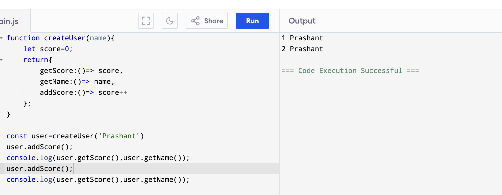
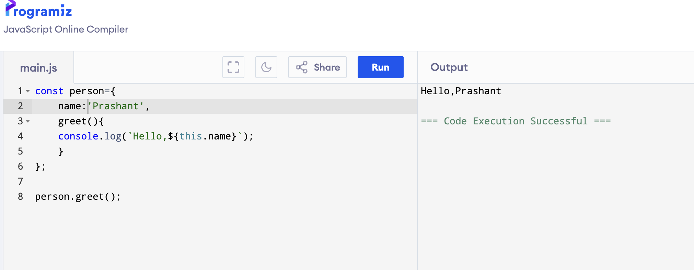

# Day1

## Learned about
    -closures(helpful in data caching,encapsulation(data hiding),creating private variables)
    -modules(import,exports)
    -values and references
    -this keyword

## 15 small function +jest
    -tested 15 functions using jest  and all tests are green.
    -learned about the basic concepts and mainly import and export modules.
    -used some default or inbuilt functions and operators.
